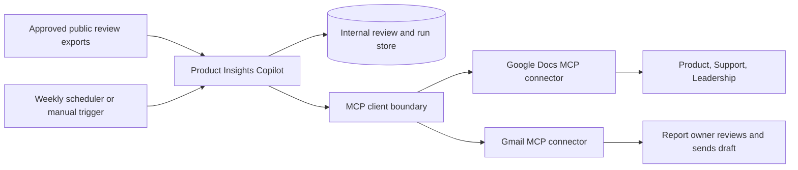
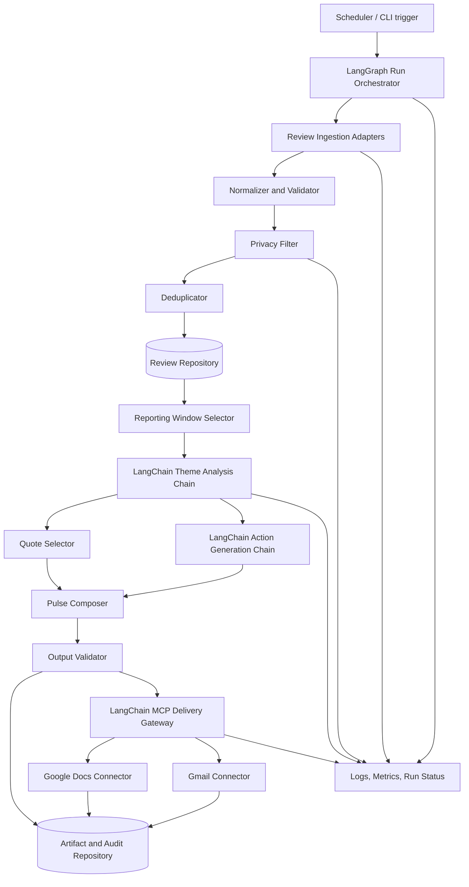
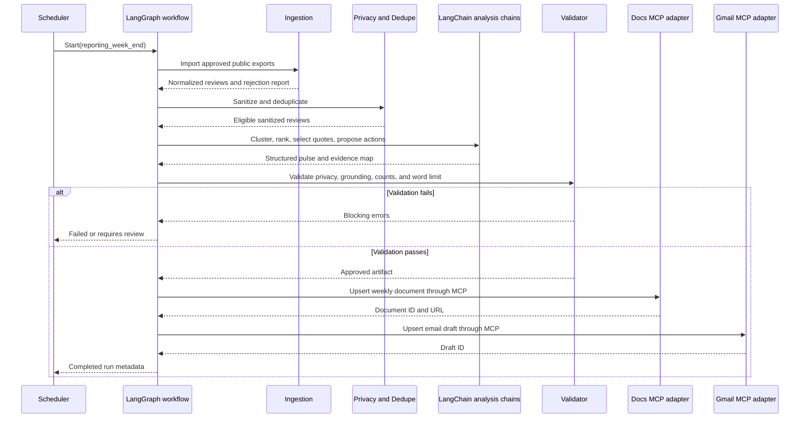
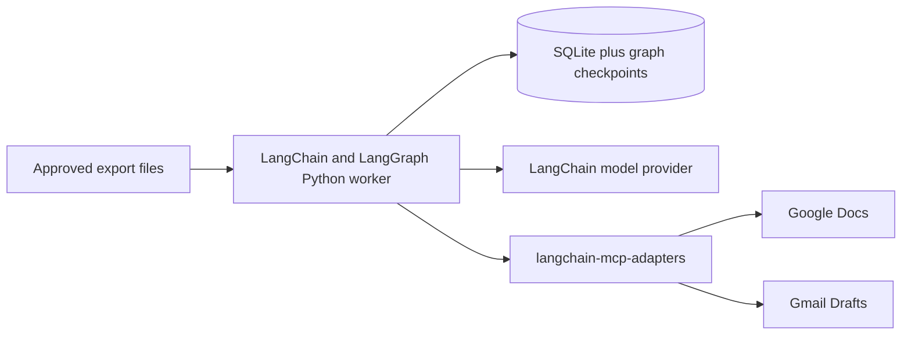

# Product Insights Copilot - System Architecture

## 1. Document Purpose

This document defines the technical architecture for the Product Insights Copilot described in [problemStatement.md](./problemStatement.md). It is intended to be detailed enough to guide implementation, testing, deployment, and operational ownership.

The system converts recent public Groww app-store reviews into a privacy-safe weekly pulse, publishes that pulse to Google Docs, and creates a Gmail draft through Model Context Protocol (MCP) integrations. The Python implementation uses **LangChain** for model abstraction, prompt composition, batching, retries, and typed structured output; **LangGraph** provides the resumable workflow; and `langchain-mcp-adapters` bridges the workflow to the configured MCP servers.

## 2. Goals and Non-Goals

### 2.1 Goals

- Import public Google Play and Apple App Store reviews from a rolling 8-12 week window.
- Normalize reviews from different export formats into one internal schema.
- Remove or reject personally identifiable information (PII) before analysis or publication.
- Deduplicate reviews and make repeated runs idempotent.
- Organize reviews into no more than five evidence-based themes.
- Rank and present the top three themes for the reporting period.
- Select three anonymous, verbatim quotes that are traceable to source reviews.
- Generate three concrete action ideas grounded in the review evidence.
- Produce a scannable weekly pulse of at most 250 words.
- Create or update the pulse in Google Docs through an MCP connector.
- Create a Gmail draft through an MCP connector; the system must never send the email automatically.
- Use LangChain with typed Pydantic output schemas for theme analysis and action generation.
- Use LangGraph to express the pipeline as a resumable, checkpointed state graph.
- Preserve enough run metadata to audit how every published statement was produced.

### 2.2 Non-Goals

- Scraping reviews behind a login or bypassing store protections.
- Using a bespoke Google OAuth client or direct Google Docs/Gmail REST integration as the primary delivery path.
- Replying to app-store reviews.
- Sending email automatically.
- Collecting reviewer profiles, usernames, email addresses, device identifiers, or other PII.
- Providing real-time alerting; the initial product is a weekly batch workflow.
- Replacing product, support, or leadership judgment with fully autonomous prioritization.
- Performing sentiment analysis as an end in itself. Sentiment is supporting metadata for theme and severity analysis.
- Allowing an autonomous LangChain agent to decide whether to publish a document or send an email.

## 3. Architectural Principles

1. **Public data only:** ingestion accepts approved public exports or terms-compliant public data sources.
2. **Privacy before intelligence:** PII filtering happens before clustering, summarization, or external delivery.
3. **Evidence over fluency:** every theme, quote, and action must be linked to review evidence.
4. **Deterministic guardrails around probabilistic analysis:** schemas, validators, caps, word counts, and traceability checks constrain model output.
5. **MCP-first delivery:** Google Docs and Gmail operations are performed through configured MCP servers/connectors.
6. **Human-controlled communication:** the output is a Gmail draft, not a sent message.
7. **Idempotent weekly runs:** retrying the same reporting period must not create duplicate documents or drafts.
8. **Replaceable adapters:** review sources, analysis models, persistence, and MCP connectors are isolated behind interfaces.
9. **Framework at the edges of the domain:** domain schemas, privacy rules, evidence checks, and output validators remain plain Python so they can be tested without LangChain.
10. **Deterministic tool control:** LangGraph nodes invoke allowlisted MCP tools only after validation; review text never decides which tool is called.

## 4. Assumptions and Decisions Pending Confirmation

| Item | Current architecture assumption | Required confirmation |
| --- | --- | --- |
| Google Play product | Package ID is `com.nextbillion.groww` | None unless the target app changes |
| Apple App Store product | Supplied through configuration | Groww Apple App Store ID or URL |
| Review acquisition | A user-provided or approved public CSV/JSON export is the safest default | Select the terms-compliant export/provider for each store |
| Lookback period | Configurable from 8 to 12 weeks; default is 10 weeks | Confirm desired default |
| Schedule | One run per week in IST (`Asia/Kolkata`, `+05:30`) | Confirm the day and time |
| Report recipient | Configured alias/address, never derived from review data | Provide recipient or alias |
| Google destination | One folder and one stable document per reporting week | Provide destination folder and sharing policy |
| Analysis engine | LangChain chat-model abstraction with Pydantic structured output plus deterministic validation | Select a supported model/provider integration |
| Workflow engine | LangGraph state graph with durable checkpoints | Select the production checkpointer with the persistence backend |
| MCP client | `langchain-mcp-adapters` with configured Docs/Drive and Gmail servers | Confirm server transports, tool names, and schemas |
| Runtime | Python worker with LangChain, LangGraph, and SQLite for MVP | Confirm deployment environment and expected data volume |

No pending decision should weaken the privacy, public-data, five-theme, 250-word, MCP-first, or draft-only constraints.

## 5. System Context



The system has two trust boundaries:

- **External input boundary:** untrusted public review data enters the system.
- **External delivery boundary:** only validated, privacy-safe report content may cross into Google Docs and Gmail through MCP.

## 6. High-Level Component Architecture

The recommended implementation is a **LangChain-based modular monolith using ports and adapters**. A single deployable worker keeps the MVP operationally simple, while explicit interfaces isolate review sources, persistence, model analysis, and MCP delivery so they can be replaced independently. This project does not need microservices at its initial scale.



### 6.1 LangChain Framework Boundary

LangChain is a good fit, but it is not the entire application. Its responsibility is limited to capabilities that benefit from framework abstraction:

- Initializing the configured chat model through a LangChain provider package
- Rendering versioned `ChatPromptTemplate` prompts
- Producing Pydantic-validated structured outputs with `with_structured_output(...)`
- Batching model calls and applying bounded retry behavior
- Exposing configured MCP server tools through `langchain-mcp-adapters`
- Providing callbacks for sanitized timing, token-usage, and error metrics

LangGraph owns control flow, checkpoints, conditional routing, and recovery. Plain Python services own ingestion, normalization, privacy filtering, deduplication, ranking, quote extraction, word counting, and final validation.

The architecture deliberately does **not** expose Google Docs or Gmail tools to the review-analysis model. Delivery tools are loaded into an allowlisted MCP adapter and called from deterministic post-validation graph nodes. This prevents review text or model behavior from triggering publication or email operations.

### 6.2 Framework Dependency Set

The implementation should declare and lock compatible releases of:

```text
langchain
langgraph
langchain-mcp-adapters
pydantic
<one LangChain model-provider integration package>
<one LangGraph checkpointer package when required by the selected database>
```

Exact versions belong in the lockfile rather than this architecture document. Automated dependency updates must run unit, structured-output, graph-resume, and MCP contract tests before merge.

## 7. Component Responsibilities

### 7.1 Trigger and Scheduler

Starts a run either:

- Automatically on a weekly schedule; or
- Manually through a CLI or job runner for testing and recovery.

It supplies a `reporting_week_end` date. All other date boundaries are calculated from that value and the configured lookback period. This makes backfills reproducible.

### 7.2 LangGraph Run Orchestrator

Implements the pipeline as a compiled LangGraph `StateGraph`. Each major stage is a graph node with typed input/output state, and conditional edges route validation failures, retryable connector failures, and successful completion. It:

- Creates or resumes a run using an idempotency key.
- Executes stages in order.
- Persists stage status and validation results.
- Retries transient integration failures.
- Prevents publication when a required validation fails.
- Records the final Google Doc identifier/URL and Gmail draft identifier.

The graph uses the stable `run_key` as its thread/execution key and a durable checkpointer compatible with the selected persistence backend. Graph state contains sanitized IDs, counts, structured analysis results, validation status, and artifact references; it never contains raw review exports or connector credentials.

Nodes with external side effects must be idempotent because checkpoint recovery can replay work. Before a Docs or Gmail tool call, the node checks the run repository for an existing artifact ID. After the call, it persists the returned ID before allowing the graph to advance.

Recommended run states:

`CREATED -> INGESTING -> SANITIZING -> ANALYZING -> COMPOSING -> VALIDATING -> PUBLISHING_DOC -> CREATING_DRAFT -> COMPLETED`

Any stage may transition to `FAILED_RETRYABLE` or `FAILED_TERMINAL`. A resumed run continues from the last completed durable stage.

### 7.3 Review Ingestion Adapters

Adapters accept store-specific public exports and emit a common record format. Initial adapters should support:

- Google Play CSV or JSON export
- Apple App Store CSV or JSON export
- Local fixture files for development and automated tests

Each adapter is responsible only for parsing and source-specific field mapping. It must not perform thematic analysis.

Required behavior:

- Reject unsupported file types and malformed rows.
- Preserve the original review text internally until privacy processing completes.
- Record the source store and source review identifier when the export provides one.
- Apply the configured reporting cutoff and lookback dates.
- Never capture reviewer display names even if an export includes them.

The ingestion source must be explicitly allowlisted. Adding an automated provider requires a terms-of-service review and does not change the downstream contract.

### 7.4 Normalizer and Input Validator

Maps input rows to `ReviewRecord` and applies deterministic checks:

- Normalize timestamps to IST (`Asia/Kolkata`, `+05:30`) while retaining the source date and original offset when available.
- Normalize ratings to an integer from 1 to 5.
- Normalize store values to `google_play` or `apple_app_store`.
- Decode text as UTF-8 and normalize Unicode without rewriting wording.
- Reject records with missing review text, invalid dates, or invalid ratings.
- Strip leading/trailing whitespace only; do not paraphrase review text.

Malformed-record counts are included in the run manifest, but malformed content is not passed to the analysis engine.

### 7.5 Privacy Filter

Runs before any model call or delivery step. It detects:

- Email addresses
- Phone numbers
- Account, tax, bank, or card-like identifiers
- Device identifiers
- URLs or handles that identify an individual
- Names or other free-text identifiers when confidence is high

The filter produces a sanitized analysis copy and a set of privacy findings. The raw import should have a short retention period and tightly limited access.

Quote policy:

1. Prefer source reviews with no detected PII.
2. A published quote must exactly match a contiguous span in the sanitized source text.
3. Do not publish a quote requiring semantic rewriting.
4. If redaction would be necessary, choose another quote rather than modifying the wording.
5. If three safe quotes are unavailable, fail report validation and require human review.

This reconciles the need for anonymous quotes with the requirement that quotes remain verbatim.

### 7.6 Deduplicator

Prevents duplicate imports across overlapping weekly windows and repeated exports.

Deduplication keys, in priority order:

1. Stable source review ID plus store.
2. A keyed fingerprint of `store + normalized_review_text + rating + source_date`.

The keyed fingerprint must not expose review text in logs. Exact duplicates are collapsed; near-duplicates should be flagged for analysis but not automatically removed in the MVP.

### 7.7 Review Repository

Stores sanitized review data, processing metadata, theme assignments, and source provenance. SQLite is suitable for a local MVP; PostgreSQL is preferred for a hosted, concurrent, or multi-product deployment.

Raw exports should be stored separately from sanitized records and deleted according to the retention policy. Analysis and delivery operate only on sanitized records.

### 7.8 Reporting Window Selector

Selects reviews where:

`window_start <= review_date <= reporting_week_end`

The lookback is configurable within the required 8-12 week range. A run records its resolved start and end dates so results remain reproducible after configuration changes.

It also computes deterministic aggregates used by the analysis engine:

- Review count by store and rating
- Average rating
- Rating distribution
- Review volume by week
- Data completeness and rejection counts

### 7.9 Theme Analysis Engine

Produces no more than five coherent themes from sanitized review text using a **Hybrid Clustering Approach**. First, a fast local ML model (e.g., `sentence-transformers`) generates text embeddings for each sanitized review. An unsupervised clustering algorithm (e.g., `K-Means`) then groups these embeddings into up to five deterministic clusters locally.

Next, a highly representative sample of reviews from each cluster is sent to a configured LangChain chat model wrapped with `with_structured_output(ThemeBatchOutput)`. The LLM's job is purely to synthesize the human-readable theme label and one-sentence description for the pre-calculated clusters, eliminating the need to send the entire review dataset to an external API.

Process:

1. Convert all sanitized reviews into mathematical embeddings using a local model.
2. Cluster the embeddings into a maximum of 5 groups.
3. Select the most central/representative reviews from each cluster (e.g., top 10).
4. Send the sampled reviews to the LLM to generate candidate labels and descriptions for each cluster.
5. Assign every eligible review to a primary theme based on its local cluster.
6. Calculate deterministic metrics (count, share) for each final theme.
7. Rank themes and select the top three.

Retry only transport, throttling, and parse failures for the LLM step; do not silently retry a semantically invalid result without recording the validation error.

Theme labels should describe a product area or user problem, such as KYC verification or withdrawals, rather than vague sentiment labels such as "negative feedback."

The analyzer should support multilingual review text directly when the selected model can do so. It may summarize themes and actions in the configured report language, but it must never translate a published quote: quotes remain in their original language and exact source wording. Store an optional detected language code for evaluation and coverage metrics, not for identifying a reviewer.

Every theme must contain:

- A stable theme ID for the run
- A short label
- A one-sentence description
- Assigned review IDs
- Review count and share
- Rating distribution
- Representative evidence review IDs
- Confidence score

Only primary assignments contribute to theme volume and review share; secondary tags are contextual metadata and do not affect ranking. Rank themes lexicographically using these deterministic keys:

1. Primary review count, descending
2. Share of 1- and 2-star reviews, descending, as the first tie-breaker
3. Share of theme reviews from the most recent two weeks, descending, as the second tie-breaker
4. Normalized theme label, ascending, as the final stable tie-breaker

This volume-first rule directly represents what users discuss most often while still resolving ties using severity and recency. The calculation and rule version must be stored in the run manifest.

### 7.10 Quote Selector

Selects exactly three quotes from the top themes. Selection rules:

- Use only privacy-approved reviews.
- Copy a contiguous verbatim snippet; never generate quote text.
- Confirm the snippet by exact string matching against sanitized source text.
- Prefer coverage across the top themes.
- Use three distinct source reviews.
- Prefer concise, specific, understandable excerpts.
- Avoid duplicate or substantially overlapping statements.
- Store the source review ID internally, but never publish reviewer identity.

If the report presents one quote per top theme, the association must match the review's final theme assignment.

### 7.11 Action Generator

Uses a separate LangChain structured-output chain, `with_structured_output(ActionSet)`, to generate exactly three concrete action ideas. It receives only validated theme summaries, aggregate metrics, and evidence excerpts selected from sanitized reviews. Each action must include internal evidence links to one or more theme/review IDs and should state:

- The proposed next step
- The user problem it addresses
- The team or function likely to own it
- A measurable follow-up signal

Only the concise next step appears in the 250-word pulse. Ownership, evidence, and measurement metadata remain in the audit artifact.

The generator must not claim technical root causes that are absent from reviews or verified product data. Review evidence describes symptoms and user experience, not necessarily implementation causes.

### 7.12 Pulse Composer

Builds a structured report with:

- Reporting period
- Optional review-count context
- Top three themes
- Three anonymous quotes
- Three action ideas

The composer should generate structured JSON first and render Markdown/plain text second. This keeps validation independent from prose formatting.

The 250-word limit applies to the visible weekly-pulse body, including section labels, theme summaries, quotes, and actions. The document title, generated timestamp, and email wrapper are excluded. A single shared Unicode-aware counter must be used in composition, validation, and tests; Markdown formatting markers are ignored and a displayed hyperlink counts as its visible label rather than its URL.

Recommended concise layout:

```text
Weekly Product Pulse: <date range>

Top themes
1. <theme and evidence summary>
2. <theme and evidence summary>
3. <theme and evidence summary>

User voices
- "<verbatim quote>"
- "<verbatim quote>"
- "<verbatim quote>"

Recommended actions
1. <action>
2. <action>
3. <action>
```

### 7.13 Output Validator

Publication is blocked unless all checks pass:

- The resolved lookback is between 8 and 12 weeks.
- At least one eligible review exists; production policy may set a higher minimum.
- There are no more than five final themes.
- Exactly three themes are highlighted; insufficient evidence fails validation and routes the run to human review.
- Exactly three quotes are present.
- Every quote exactly matches its privacy-approved source review.
- No PII detector finding remains in report content.
- Exactly three actions are present.
- Every theme and action has evidence links internally.
- The rendered pulse is no more than 250 words.
- The document title and reporting period are present.
- No reviewer name, source identifier, email, device ID, or account identifier is rendered.
- Model output conforms to the expected JSON schema.

Validation errors are actionable and stored with the run. Invalid content must never be passed to MCP delivery tools.

### 7.14 MCP Delivery Gateway

Provides application-level interfaces while hiding connector-specific tool names and payloads:

```text
DocumentPublisher.append_weekly_pulse(run_key, document_id, content) -> DocumentReference
EmailDraftCreator.upsert_draft(run_key, recipient, subject, body) -> DraftReference
```

Responsibilities:

- Confirm that only validated output is submitted.
- Translate internal structures to the available MCP tool schemas.
- Apply timeouts and bounded retries for transient failures.
- Record sanitized request metadata and returned artifact IDs.
- Never log connector credentials or full report content at normal log levels.
- Never fall back to direct Google REST calls.

The gateway initializes `MultiServerMCPClient` from `langchain-mcp-adapters` using an `SSEServerTransport` connecting to the Railway remote deployment. It loads tools with `get_tools()`, and filters them against a configured allowlist before use. It maps semantic roles such as `google_docs_append_text` and `gmail_create_draft` to discovered connector tools during preflight, validates each tool's input schema, and fails closed if a required capability is missing or ambiguous. Explicitly, if `gmail_send_email` is discovered, it is blocked by the allowlist and cannot be executed.

`MultiServerMCPClient` is stateless by default, so application state and idempotency remain in `RunRepository`, not in an MCP session. If a selected connector requires session continuity, the delivery node may open an explicit short-lived session for that stage; the session must not become the source of truth for run status.

MCP tools are invoked programmatically by deterministic delivery nodes. They are not bound to the theme or action model as agent tools. In particular, any Gmail send tool discovered from a server is removed from the allowlist and cannot be called.

Before the first production run, a read-only preflight verifies that required product IDs, approved input sources, recipient allowlist, destination folder, and connector capabilities are configured. It must confirm that the Docs connector can create/update documents and that the Gmail connector can create drafts. A two-store production run is blocked until both app identifiers and input adapters are configured. No preflight or runtime path should invoke email sending.

### 7.15 Google Docs Publisher

Uses the configured Google Docs/Drive MCP connector to create or update one document for a reporting period.

Idempotency strategy:

- Use `product + reporting_week_end` as the logical document key.
- Persist the returned document ID after creation.
- On retry, update the stored document rather than create another.
- If state is lost, search only the configured destination folder for a machine-readable run marker before creating a new document.

The document should contain only the validated pulse plus minimal metadata such as generation time and reporting range. It must not contain internal review IDs, prompts, PII findings, or raw reviews.

Recommended title: `Product Insights Pulse - Groww - YYYY-MM-DD`.

### 7.16 Gmail Draft Creator

Runs only after document publication succeeds. It uses the Gmail MCP connector to create a draft with:

- Configured recipient or alias
- Subject containing product and reporting week
- Short body containing the pulse, the Google Doc link, or both
- No attachment unless explicitly added in a future approved requirement

The component must use draft-creation capability only. It must not invoke a send operation.

Recommended subject: `Product Insights Pulse - Groww - YYYY-MM-DD`.

Idempotency strategy:

- Persist the returned draft ID.
- Reuse or replace the existing draft for the same run key rather than creating duplicates.
- Include a non-visible or unobtrusive run marker if supported by the connector.

## 8. End-to-End Processing Sequence



## 9. Data Model

Domain and model-output contracts are defined as Pydantic models. LangChain uses the analysis output models as structured-output schemas, while deterministic services reuse the same models for runtime validation. Persistence adapters map these domain models to database records without making the domain depend on an ORM.

### 9.1 ReviewRecord

| Field | Type | Notes |
| --- | --- | --- |
| `review_id` | UUID | Internal identifier |
| `source_store` | enum | `google_play` or `apple_app_store` |
| `source_review_key` | string/null | Hashed or protected stable source ID; never published |
| `rating` | integer | 1-5 |
| `title` | string/null | Sanitized before analysis |
| `review_text` | string | Raw only in restricted transient storage |
| `source_date` | date/time | Date supplied by export |
| `language_code` | string/null | Optional detected or source-provided language |
| `imported_at` | timestamp | ISO 8601 timestamp in IST (`+05:30`) |
| `source_batch_id` | UUID | Links to import manifest |
| `content_fingerprint` | string | Keyed deduplication hash |

### 9.2 SanitizedReview

| Field | Type | Notes |
| --- | --- | --- |
| `review_id` | UUID | References `ReviewRecord` |
| `sanitized_title` | string/null | No detected PII |
| `sanitized_text` | string | Input to analysis |
| `privacy_status` | enum | `approved`, `rejected`, or `needs_review` |
| `privacy_finding_types` | array | Category names only; do not store sensitive values in logs |
| `sanitizer_version` | string | Enables reproducibility |

### 9.3 ThemeAssignment

| Field | Type | Notes |
| --- | --- | --- |
| `run_id` | UUID | Reporting run |
| `theme_id` | string | Stable within run |
| `review_id` | UUID | Evidence record |
| `assignment_type` | enum | `primary` or `secondary` |
| `confidence` | decimal | 0-1 |
| `analysis_version` | string | Prompt/model/rules version |

### 9.4 ThemeSummary

| Field | Type | Notes |
| --- | --- | --- |
| `theme_id` | string | Stable within run |
| `label` | string | Short, specific label |
| `description` | string | Grounded summary |
| `review_count` | integer | Deterministic count |
| `review_share` | decimal | Theme count / eligible count |
| `average_rating` | decimal | Deterministic aggregate |
| `low_rating_share` | decimal | Share of 1- and 2-star primary assignments |
| `recent_review_share` | decimal | Share from the most recent two weeks |
| `rank_position` | integer | Result of the versioned volume-first sort |
| `evidence_review_ids` | array | Internal traceability |

### 9.5 WeeklyPulse

| Field | Type | Notes |
| --- | --- | --- |
| `run_id` | UUID | Source run |
| `period_start` | date | Resolved lookback start |
| `period_end` | date | Reporting cutoff |
| `top_themes` | array[3] | References `ThemeSummary` |
| `quotes` | array[3] | Text plus internal review reference |
| `actions` | array[3] | Text plus internal evidence references |
| `rendered_content` | string | At most 250 words |
| `word_count` | integer | Deterministically calculated |
| `validation_status` | enum | Must be `passed` before delivery |
| `content_version` | string | Template/prompt version |

### 9.6 RunManifest

| Field | Type | Notes |
| --- | --- | --- |
| `run_id` | UUID | Run identifier |
| `run_key` | string | Product plus reporting week; unique |
| `status` | enum | State-machine status |
| `period_start` / `period_end` | date | Fixed run boundaries |
| `source_counts` | object | Imported/accepted/rejected counts |
| `config_version` | string | Configuration snapshot reference |
| `analysis_version` | string | Model, prompt, and ranking versions |
| `validation_results` | object | Check names and outcomes |
| `document_id` / `document_url` | string/null | Delivery result |
| `draft_id` | string/null | Gmail delivery result |
| `started_at` / `completed_at` | timestamp | ISO 8601 timestamps in IST (`+05:30`) |
| `error_code` | string/null | Sanitized operational error |

### 9.7 WorkflowState

The LangGraph state is a typed structure containing references and validated results rather than raw connector payloads:

| Field | Type | Notes |
| --- | --- | --- |
| `run_id` / `run_key` | string | Durable execution identity |
| `period_start` / `period_end` | date | Fixed reporting window |
| `eligible_review_ids` | array | Sanitized repository references only |
| `theme_analysis` | object/null | Validated `ThemeAnalysis` Pydantic model |
| `weekly_pulse` | object/null | Validated `WeeklyPulse` Pydantic model |
| `validation_report` | object/null | Deterministic gate result |
| `document_reference` | object/null | Docs artifact ID and URL |
| `draft_reference` | object/null | Gmail draft ID |
| `attempts_by_node` | object | Bounded retry counters |
| `last_error` | object/null | Sanitized code and category, no review text |

## 10. API and Module Contracts

Suggested framework-independent internal interfaces:

```python
class ReviewSource(Protocol):
    def load(self, period_start: date, period_end: date) -> Iterable[RawReview]: ...

class PrivacyService(Protocol):
    def sanitize(self, review: RawReview) -> SanitizedReview: ...

class ThemeAnalyzer(Protocol):
    async def analyze(self, reviews: Sequence[SanitizedReview]) -> ThemeAnalysis: ...

class ActionGenerator(Protocol):
    async def generate(self, analysis: ThemeAnalysis) -> ActionSet: ...

class PulseBuilder(Protocol):
    def build(self, analysis: ThemeAnalysis) -> WeeklyPulse: ...

class PulseValidator(Protocol):
    def validate(self, pulse: WeeklyPulse, evidence: EvidenceMap) -> ValidationReport: ...

class DocumentPublisher(Protocol):
    async def upsert(self, run_key: str, pulse: WeeklyPulse) -> DocumentReference: ...

class DraftCreator(Protocol):
    async def upsert(self, run_key: str, recipient: str,
                     pulse: WeeklyPulse,
                     document: DocumentReference) -> DraftReference: ...
```

`LangChainThemeAnalyzer`, `LangChainActionGenerator`, `LangChainMCPDocumentPublisher`, and `LangChainMCPDraftCreator` implement these ports. Connector payload schemas should be isolated in adapter modules so a LangChain/provider upgrade or MCP server change does not affect domain logic.

### 10.1 LangChain Structured-Output Pattern

Illustrative construction; bootstrap code supplies the configured provider package and model name:

```python
from langchain.chat_models import init_chat_model
from langchain_core.prompts import ChatPromptTemplate

model = init_chat_model(
    model=config.analysis.model,
    model_provider=config.analysis.provider,
    temperature=0,
)

theme_prompt = ChatPromptTemplate.from_messages([
    ("system", THEME_SYSTEM_PROMPT),
    ("human", "Analyze only the untrusted review data below:\n{review_batch}"),
])

theme_chain = theme_prompt | model.with_structured_output(ThemeBatchOutput)
```

`ThemeBatchOutput` and `ActionSet` use strict Pydantic constraints for allowed counts, IDs, text lengths, and forbidden extra fields. Framework parsing success is necessary but not sufficient: domain validators still check evidence membership, maximum themes, exact quote spans, PII, and the final word limit.

### 10.2 LangGraph Construction Pattern

```python
from langgraph.graph import END, START, StateGraph

builder = StateGraph(WorkflowState)
builder.add_node("ingest", ingest_node)
builder.add_node("sanitize", sanitize_node)
builder.add_node("analyze", analyze_node)
builder.add_node("validate", validate_node)
builder.add_node("publish_doc", publish_doc_node)
builder.add_node("create_draft", create_draft_node)

builder.add_edge(START, "ingest")
builder.add_edge("ingest", "sanitize")
builder.add_edge("sanitize", "analyze")
builder.add_edge("analyze", "validate")
builder.add_conditional_edges("validate", route_after_validation)
builder.add_edge("publish_doc", "create_draft")
builder.add_edge("create_draft", END)

workflow = builder.compile(checkpointer=checkpointer)
```

The production graph also includes composition and explicit failure/review nodes. The shortened example shows the control boundary: delivery nodes cannot be reached until validation passes.

### 10.3 MCP Adapter Pattern

```python
from langchain_mcp_adapters.client import MultiServerMCPClient

client = MultiServerMCPClient(runtime_mcp_config)
discovered_tools = await client.get_tools()
allowed_tools = tool_registry.resolve_and_allowlist(discovered_tools)

# Called by a deterministic graph node, not selected by the analysis model.
result = await allowed_tools.google_docs_append_text.ainvoke(validated_docs_payload)
```

The runtime MCP configuration owns server transport (using `SSEServerTransport` for the remote Railway deployment) and authentication. The application configuration stores only logical server aliases and tool roles.

## 11. Suggested Repository Structure

```text
product-insights-copilot/
|-- architecture.md
|-- problemStatement.md
|-- pyproject.toml
|-- README.md
|-- config/
|   |-- default.yaml
|   `-- themes.yaml
|-- src/product_insights/
|   |-- cli.py
|   |-- config.py
|   |-- bootstrap.py
|   |-- domain/
|   |   |-- models.py
|   |   |-- ports.py
|   |   `-- errors.py
|   |-- ingestion/
|   |   |-- base.py
|   |   |-- google_play_export.py
|   |   `-- app_store_export.py
|   |-- processing/
|   |   |-- normalize.py
|   |   |-- privacy.py
|   |   |-- deduplicate.py
|   |   `-- window.py
|   |-- analysis/
|   |   |-- schemas.py
|   |   |-- model_factory.py
|   |   |-- theme_chain.py
|   |   |-- action_chain.py
|   |   |-- ranking.py
|   |   |-- quotes.py
|   |   `-- validators.py
|   |-- reporting/
|   |   |-- composer.py
|   |   `-- validator.py
|   |-- integrations/
|   |   |-- mcp_client.py
|   |   |-- mcp_preflight.py
|   |   |-- tool_registry.py
|   |   |-- google_docs.py
|   |   `-- gmail.py
|   |-- persistence/
|   |   |-- repository.py
|   |   `-- migrations/
|   `-- orchestration/
|       |-- state.py
|       |-- nodes.py
|       |-- graph.py
|       |-- checkpointer.py
|       `-- scheduler.py
|-- prompts/
|   |-- theme_analysis.md
|   `-- action_generation.md
|-- tests/
|   |-- unit/
|   |-- integration/
|   |-- contract/
|   |-- privacy/
|   `-- fixtures/
`-- var/
    |-- imports/        # restricted and short-lived; never committed
    `-- artifacts/      # local run artifacts; never committed
```

## 12. Configuration

Configuration should be validated at startup and must not contain connector secrets in source control.

```yaml
product:
  name: Groww
  google_play_package: com.nextbillion.groww
  apple_app_store_id: null

reporting:
  lookback_weeks: 10
  timezone: Asia/Kolkata
  schedule: "0 9 * * MON"
  max_themes: 5
  highlighted_themes: 3
  quote_count: 3
  action_count: 3
  max_words: 250

analysis:
  framework: langchain
  provider: null
  model: null
  temperature: 0
  max_concurrency: 4
  theme_prompt_version: v1
  action_prompt_version: v1

workflow:
  framework: langgraph
  checkpointer: sqlite

mcp:
  client: langchain-mcp-adapters
  docs_server: null
  gmail_server: null
  docs_tool_role: docs_upsert
  gmail_tool_role: gmail_create_draft

delivery:
  recipient: null
  google_drive_folder_id: null
  create_email_draft_only: true

retention:
  raw_import_days: 7
  sanitized_review_days: 180
  run_manifest_days: 365
```

Invariant values required by the problem statement should be validated even when configurable. For example, `max_themes` must not exceed 5, and `lookback_weeks` must remain from 8 through 12.

## 13. Security and Privacy Architecture

### 13.1 Data Classification

| Data | Classification | Handling |
| --- | --- | --- |
| Raw review export | Restricted/untrusted | Short retention, access-limited, never delivered |
| Sanitized review text | Internal | Used for analysis, access-controlled |
| Theme and audit evidence | Internal | Retained for reproducibility, not published |
| Weekly pulse | Shareable internally | Delivered to configured Docs location and Gmail draft |
| MCP credentials/tokens | Secret | Managed by connector/runtime, never stored by application |

### 13.2 Required Controls

- Validate and sanitize untrusted input before analysis.
- Use least-privilege MCP connections scoped to the required Docs/Drive and Gmail draft operations.
- Keep connector authentication outside application configuration and logs.
- Encrypt data at rest when the deployment platform supports it.
- Use TLS for model and MCP traffic.
- Do not place raw reviews or PII findings in prompts after the privacy stage.
- Protect against prompt injection in reviews by treating review text strictly as data and using fixed structured prompts.
- Reject model instructions, links, or tool requests found inside review content.
- Keep the analysis chains tool-free; never bind Docs, Gmail, filesystem, shell, or network tools to them.
- Disable content-bearing LangChain tracing in production by default. If external tracing is enabled, send only sanitized metadata after privacy and retention review.
- Redact sensitive content from exceptions and logs.
- Restrict the Gmail integration to draft creation; sending remains a human action.
- Keep Google Doc sharing inherited from a preconfigured destination rather than making it public.

### 13.3 Retention

- Delete raw imports after a short configurable period, proposed as seven days.
- Retain sanitized reviews only as long as needed for trend analysis and audit, proposed as 180 days.
- Retain run manifests longer, proposed as one year, without raw text or PII.
- Make retention values configurable to align with organizational policy.

## 14. Reliability and Failure Handling

| Failure | Expected behavior |
| --- | --- |
| Export missing or unreadable | Stop before analysis; report actionable ingestion error |
| Some malformed rows | Quarantine rows, record counts, continue if minimum data threshold is met |
| No eligible reviews | Do not fabricate a pulse; mark run as requiring review |
| PII filter uncertainty | Exclude affected reviews/quotes or route to human review |
| Model timeout/rate limit | Retry with exponential backoff and jitter, then resume from durable stage |
| Invalid model schema | Retry once with schema feedback, then fail validation |
| LangGraph worker restarts | Resume from the durable checkpoint using the same run key |
| Checkpoint is unavailable/corrupt | Stop side effects, reconcile stored artifact IDs, and require operator recovery |
| More than five themes | Deterministically merge/reduce or fail analysis; never publish over the cap |
| Pulse over 250 words | Recompose and revalidate; never truncate a quote silently |
| Google Docs MCP unavailable | Keep validated artifact, mark retryable, do not create email draft yet |
| Gmail MCP unavailable | Preserve document result and retry draft creation only |
| Retry after partial delivery | Use stored artifact IDs and upsert semantics to avoid duplicates |

Retries should be bounded. Terminal failures should preserve a sanitized diagnostic summary and clear recovery instruction.

## 15. Observability and Auditability

### 15.1 Structured Logs

Include:

- Run ID and run key
- Pipeline stage
- Duration and status
- Record counts, never raw review text
- Error category and retry count
- MCP operation type and sanitized artifact identifier
- LangGraph node name and checkpoint/run key
- LangChain model integration name and prompt/schema version, but not prompt content

Never log review bodies, quotes, prompts containing review text, connector tokens, recipient credentials, or detected PII values.

### 15.2 Metrics

- Runs completed/failed by week
- Reviews imported, rejected, privacy-blocked, and deduplicated
- Eligible reviews by store
- Theme count and confidence distribution
- Validation failures by rule
- Pulse word count
- End-to-end and per-stage latency
- LangChain request count, token usage, structured-output validation failures, and retry count
- LangGraph node duration, resume count, and checkpoint failures
- MCP retry/failure rate
- Duplicate-document or duplicate-draft incidents

### 15.3 Audit Artifact

For each run, retain a private machine-readable artifact containing:

- Configuration and version snapshot
- Input counts and fingerprints
- Final theme assignments
- Quote-to-review exact-match evidence
- Action-to-theme evidence mapping
- Validation report
- Model/prompt/template versions
- Google Doc and Gmail draft references

This artifact is not copied into Google Docs or Gmail.

## 16. Testing Strategy

### 16.1 Unit Tests

- Store-specific parsing and field mapping
- Date-window boundary behavior
- Rating and text normalization
- PII detection and privacy status rules
- Exact and fallback deduplication
- Theme ranking calculation
- Quote exact-match verification
- Word counting
- All output validation rules
- Run state transitions and idempotency-key generation
- Pydantic schemas reject extra, missing, and out-of-range model fields
- LangChain prompt templates keep review content in untrusted data delimiters

### 16.2 Integration Tests

- Import fixture -> sanitize -> persist
- Sanitized reviews -> LangChain theme/action chains with a deterministic fake chat model
- Structured pulse -> renderer -> validator
- LangGraph restart and resume from every durable checkpoint
- LangChain provider swap preserves the domain output contract
- Retry behavior for Docs and Gmail failures

### 16.3 MCP Contract Tests

Use test doubles for normal CI and a non-production connected environment for periodic contract tests:

- Create and update a test Google Doc.
- Create and update a Gmail draft without sending it.
- Verify returned identifiers and links.
- Verify no duplicate artifacts on retry.
- Verify connector permission failures are handled safely.
- Verify `MultiServerMCPClient` tool discovery and allowlist mapping.
- Verify any discovered Gmail send tool is rejected and cannot be invoked.

### 16.4 Privacy and Adversarial Tests

- Reviews containing emails, phone numbers, account numbers, names, and device IDs
- Reviews containing instructions intended to manipulate the model
- Mixed-language and Unicode reviews
- Extremely long or malformed reviews
- Quotes with PII near the desired excerpt
- Attempts to leak raw reviews into errors, logs, the document, or email draft

### 16.5 Quality Evaluation

Maintain a small, human-labeled evaluation set with expected themes and evidence. Track:

- Theme coherence and assignment agreement
- Top-theme ranking agreement
- Quote relevance and exactness
- Action grounding
- Theme coverage across represented languages
- Unsupported-claim rate
- PII leakage rate, which must be zero for published artifacts

## 17. Deployment Architecture

### 17.1 MVP

A single scheduled Python worker is sufficient:



Recommended MVP properties:

- One product and one weekly schedule
- SQLite database on encrypted persistent storage
- LangGraph SQLite checkpointer for resumable execution
- Approved export files placed in a restricted input directory
- LangChain provider credentials and MCP authentication managed by the runtime, not source control
- Scheduler supplied by the host platform or CI job runner
- Manual approval/review path for failed validation

### 17.2 Scaled Deployment

Move to a queue-backed LangGraph worker, PostgreSQL application repository, and production-grade database-backed checkpointer when supporting multiple products, users, or concurrent runs. Store raw imports in an encrypted object store with lifecycle deletion. The domain contracts, LangChain chains, and MCP gateway remain unchanged.

## 18. Performance and Capacity

The pipeline is batch-oriented and should favor correctness over low latency.

Initial targets:

- Complete a normal weekly run within 15 minutes, excluding prolonged external outages.
- Support at least 10,000 reviews per reporting run through batching.
- Keep memory bounded by streaming imports and model batches.
- Make model batch size and concurrency configurable.
- Respect source/provider and MCP connector rate limits.

These targets are architectural starting points and should be revised after observing actual Groww review volume and connector limits.

## 19. Implementation Phases

### Phase 1: Data Foundation

- Define schemas and configuration validation.
- Implement fixture, Google Play export, and Apple export adapters.
- Implement normalization, date filtering, privacy filtering, and deduplication.
- Add persistence and run manifests.

### Phase 2: Insight Pipeline

- Configure the LangChain model factory and versioned prompt templates.
- Implement Pydantic-structured LangChain theme and action chains.
- Add deterministic metrics and ranking.
- Implement exact-match quote selection.
- Implement grounded action generation.
- Add structured pulse composition and all blocking validators.

### Phase 3: MCP Delivery

- Configure Google Docs/Drive and Gmail MCP connectors.
- Initialize `MultiServerMCPClient`, tool discovery, schema checks, and the strict delivery allowlist.
- Implement LangChain MCP connector adapters and idempotent document upsert.
- Implement draft-only Gmail delivery.
- Add retry, recovery, and audit metadata.

### Phase 4: Production Hardening

- Compile the LangGraph workflow with a production checkpointer and test recovery from every node.
- Add scheduler, dashboards, alerts, retention jobs, and backup policy.
- Run privacy/adversarial testing and quality evaluation.
- Document operational recovery and human-review procedures.
- Calibrate theme ranking using stakeholder feedback.

## 20. Requirement Traceability

| Problem requirement | Architectural enforcement |
| --- | --- |
| Reviews from roughly the last 8-12 weeks | Config validator and Reporting Window Selector |
| Public reviews only | Allowlisted Review Ingestion Adapters and source review process |
| Maximum five themes | Theme Analysis Engine plus blocking Output Validator |
| Highlight top three themes | Deterministic ranking plus WeeklyPulse schema |
| Three real user quotes | Quote Selector, exact source matching, and quote-count validator |
| Three action ideas | Action Generator, evidence mapping, and action-count validator |
| One-page, at most 250 words | Pulse Composer and deterministic word-count validator |
| No PII | Privacy Filter, safe-quote policy, and final PII scan |
| Google Docs delivery | MCP Delivery Gateway and Google Docs Publisher |
| Gmail draft | Draft-only Gmail MCP adapter; no send path implemented |
| No custom Google REST/OAuth primary path | MCP boundary enforced in integration architecture |
| Safe LLM orchestration | Tool-free LangChain analysis chains plus Pydantic structured output and deterministic validators |

## 21. Key Risks and Mitigations

| Risk | Mitigation |
| --- | --- |
| Export source violates store terms | Require an approved, documented public export/provider before enabling it |
| Sparse review data produces weak themes | Enforce minimum data policy and route low-data runs to human review |
| Model invents wording or facts | Structured evidence IDs, exact quote matching, claim constraints, blocking validation |
| PII appears in a selected quote | Privacy-first processing, choose only clean quotes, final report PII scan |
| Theme labels drift week to week | Optional theme taxonomy, semantic matching, versioning, and evaluation set |
| Duplicate Docs or drafts | Unique run key, persisted artifact IDs, and upsert behavior |
| Connector schema or permissions change | Adapter isolation, contract tests, and explicit permission diagnostics |
| LangChain/provider API changes | Lock compatible packages; test provider, schema, graph-resume, and MCP contracts before upgrades |
| LangGraph replays a side-effect node | Check stored artifact references before calls and persist IDs immediately after calls |
| Email is sent unintentionally | Implement only draft creation and omit any send capability |
| Review text contains prompt injection | Treat content as quoted data, fixed system instructions, no tool access during analysis |
| 250-word limit reduces useful context | Structured prioritization, concise template, and private audit artifact for details |

## 22. Definition of Architecture Done

The implementation conforms to this architecture when:

- A reproducible weekly run imports only approved public review data.
- Production preflight confirms both store identifiers/sources and required MCP capabilities.
- The resolved review window is within 8-12 weeks.
- Raw data is normalized, privacy-filtered, and deduplicated before analysis.
- LangChain analysis calls return valid Pydantic objects and have no access to delivery tools.
- LangGraph resumes a partially completed run without repeating completed side effects.
- No more than five grounded themes are created and the top three are ranked deterministically.
- Exactly three safe, verbatim, source-verifiable quotes are selected.
- Exactly three evidence-linked action ideas are created.
- A final privacy and structural validator approves a pulse of at most 250 words.
- The validated pulse is idempotently published to Google Docs via MCP.
- A recipient-configured Gmail draft is idempotently created via MCP and is not sent.
- Every output is traceable through a sanitized run manifest and evidence map.
- Failure recovery cannot publish invalid content or produce duplicate artifacts.

## 23. Open Questions Before Implementation

1. What is the Groww Apple App Store ID or URL?
2. Which approved public export or data provider will supply reviews for each store?
3. Should the default lookback be 8, 10, or 12 weeks?
4. What day and time in IST should the weekly run use?
5. What minimum review count is required before publishing a pulse?
6. Which LangChain model-provider integration and model should perform clustering and action generation?
7. Which Google Drive folder should contain reports, and who may access it?
8. What email address or alias should receive the draft?
9. Which Google Docs/Drive and Gmail MCP servers, transports, and exact tool schemas are available in the target environment?
10. What organizational retention policy should replace or approve the proposed defaults?

## 24. LangChain Framework References

- [LangChain model structured output](https://docs.langchain.com/oss/python/langchain/models#structured-output)
- [LangChain structured output for agents](https://docs.langchain.com/oss/python/langchain/structured-output)
- [LangChain MCP integration](https://docs.langchain.com/oss/python/langchain/mcp)
- [LangGraph durable execution](https://docs.langchain.com/oss/python/langgraph/durable-execution)
