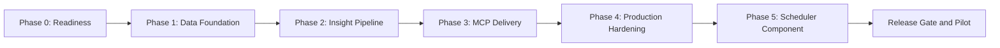

# Product Insights Copilot - Phase-wise Implementation Plan

## 1. Purpose

This plan translates the requirements in [problemStatement.md](./problemStatement.md) and the design in [architecture.md](./architecture.md) into ordered, testable implementation work.

The target outcome is a weekly, privacy-safe Groww product pulse that:

- Uses approved public Google Play and Apple App Store review exports from an 8-12 week window
- Groups reviews into no more than five themes and highlights the top three
- Includes exactly three anonymous, verbatim, source-verifiable quotes
- Includes exactly three evidence-linked action ideas
- Contains no PII and is no more than 250 words
- Is published to Google Docs through MCP
- Is included or linked in one unsent Gmail draft created through MCP
- Can be safely retried without duplicating the document or draft

## 2. Delivery Strategy

The implementation follows the modular-monolith architecture:

- **Python** for the application and deterministic domain logic
- **Pydantic** for domain and structured-output contracts
- **LangChain** for model initialization, prompts, batching, retries, and structured output
- **LangGraph** for resumable workflow orchestration
- **langchain-mcp-adapters** for Google Docs/Drive and Gmail MCP tools
- **SQLite** for the MVP application repository and graph checkpoints
- **PostgreSQL-compatible ports** for a future hosted or multi-product deployment

The plan is organized into one readiness phase, the five architecture phases, and a final release gate.

Each phase ends with a blocking quality gate. Work may be developed in parallel within a phase, but no downstream production integration should proceed until its upstream gate passes.

## 3. Global Engineering Rules

These rules apply to every phase:

1. Raw reviews are untrusted input.
2. Only approved public review exports or terms-compliant public sources may be enabled.
3. Reviewer usernames and external identities are never imported into the domain model.
4. Privacy filtering runs before LangChain model calls.
5. Analysis chains receive no Docs, Gmail, filesystem, shell, or network tools.
6. Model output is accepted only after Pydantic and domain validation.
7. Quotes are extracted by code and exact-matched to a privacy-approved source review; they are never generated or rewritten by a model.
8. Only deterministic post-validation LangGraph nodes may invoke MCP delivery tools.
9. Gmail send tools are never allowlisted; the application creates drafts only.
10. All project dates and timestamps use IST (`Asia/Kolkata`, `+05:30`).
11. The same `run_key` must reuse the same document and draft.
12. Secrets, review text, prompts containing review text, and PII values must not appear in logs or source control.

## 4. Phase Summary

| Phase | Primary outcome | Key dependency | Exit artifact |
| --- | --- | --- | --- |
| Phase 0 | Decisions, repository scaffold, and test harness are ready | Product and connector inputs | Approved configuration contract and runnable project skeleton |
| Phase 1 | Public reviews become sanitized, deduplicated, queryable records | Approved export formats | Persisted review dataset and run manifest |
| Phase 2 | Validated weekly pulse can be generated locally | Model provider and Phase 1 data | At-most-250-word structured pulse plus evidence map |
| Phase 3 | Pulse is delivered through MCP without duplicate side effects | Docs/Gmail MCP access | Google Doc reference and unsent Gmail draft reference |
| Phase 4 | Workflow is schedulable, observable, recoverable, and secure | Stable end-to-end flow | Production candidate and operations runbook |
| Phase 5 | Weekly automation of ingestion, analysis, and reporting | End-to-end workflow stability | Deployed and active scheduler component |
| Release gate | Stakeholders validate real weekly output | Production candidate | Go/no-go decision and signed-off pilot |

Indicative sequencing for one engineer is approximately four to six implementation weeks plus two weekly pilot cycles. This is a planning range, not a commitment; export access, model approval, and MCP connector readiness can materially change it.

## 5. Phase 0 - Readiness and Project Setup

### 5.1 Objective

Resolve decisions that affect contracts, permissions, and testability before implementation begins. Establish a minimal project that installs, runs, and tests consistently.

### 5.2 Entry Criteria

- [architecture.md](./architecture.md) and [problemStatement.md](./problemStatement.md) are accepted as the current source of truth.
- A technical owner and product reviewer are identified.

### 5.3 Work Packages

| ID | Work item | Implementation details | Output |
| --- | --- | --- | --- |
| P0.1 | Resolve product identifiers | Confirm `com.nextbillion.groww` and obtain the Groww Apple App Store ID/URL. | Approved product configuration |
| P0.2 | Approve review sources | Select the public CSV/JSON export or terms-compliant source for each store; document format, update frequency, and usage constraints. | Source approval record and sample exports |
| P0.3 | Select model integration | Choose one LangChain-supported provider/model with multilingual and structured-output support; record data-handling requirements. | Model decision and runtime configuration fields |
| P0.4 | Confirm MCP capabilities | **[RESOLVED]** Use remote Railway deployment (`mcp-server-production-9aac.up.railway.app/sse`) with SSE transport. Tool names: `google_docs_append_text`, `gmail_create_draft`. | MCP capability matrix |
| P0.5 | Confirm delivery settings | Set the Google Drive folder, sharing policy, Gmail recipient allowlist, and report naming convention. | Approved delivery configuration |
| P0.6 | Confirm operating policy | Decide default 8/10/12-week lookback, weekly day/time in IST, minimum eligible-review threshold, and retention periods. | Versioned operating policy |
| P0.7 | Scaffold repository | Add `pyproject.toml`, `src/`, `tests/`, `config/`, `prompts/`, migrations, and runtime artifact directories described by the architecture. | Importable Python package and CLI placeholder |
| P0.8 | Lock dependencies | Add compatible, pinned/locked LangChain, LangGraph, `langchain-mcp-adapters`, Pydantic, database, test, lint, and type-check dependencies. | Reproducible dependency lockfile |
| P0.9 | Configure quality checks | Add formatting, linting, type checking, unit tests, secret scanning, and dependency checks to local/CI commands. | Passing baseline CI pipeline |
| P0.10 | Build safe fixtures | Create synthetic Google Play and App Store exports with valid rows, malformed rows, duplicates, multilingual text, PII, and prompt-injection attempts. | Version-controlled non-production fixtures |

### 5.4 Configuration Contract

The startup configuration must include or resolve:

- Product name and both store identifiers
- Approved source adapter for each store
- Lookback weeks constrained to 8-12
- IST timezone and weekly schedule
- Minimum eligible-review threshold
- LangChain provider integration and model name
- Prompt/schema version
- LangGraph checkpointer type
- Docs/Drive and Gmail MCP server aliases
- Semantic MCP tool roles for document upsert and draft creation
- Google Drive destination and allowlisted email recipient
- Raw, sanitized, and audit retention values

Secrets and MCP authentication remain in the runtime or connector host, not the application YAML.

### 5.5 Phase 0 Exit Gate

- [ ] Both store identifiers are known.
- [ ] Both review sources are documented and approved.
- [ ] Representative export samples are available.
- [ ] A LangChain model/provider is approved.
- [ ] Docs/Drive and Gmail MCP capabilities are confirmed.
- [ ] The Gmail recipient and Drive destination are allowlisted.
- [ ] The project installs from a clean environment.
- [ ] Baseline format, lint, type, unit, secret, and dependency checks pass.
- [ ] No real user data or credentials are committed.

If either review source or required MCP capability is unresolved, development may continue against fixtures/test doubles, but the production release remains blocked.

## 6. Phase 1 - Data Foundation

### 6.1 Objective

Import approved public reviews and transform them into privacy-approved, deduplicated records with reproducible run metadata.

### 6.2 Dependencies

- Phase 0 exit gate passes for schemas and development fixtures.
- At least one representative export exists for each planned adapter.

### 6.3 Work Packages

| ID | Work item | Implementation details | Verification |
| --- | --- | --- | --- |
| P1.1 | Define domain models | Implement Pydantic models for raw input, `ReviewRecord`, `SanitizedReview`, import results, privacy findings, and `RunManifest`. Reject unknown required-domain fields where appropriate. | Schema unit tests pass |
| P1.2 | Implement configuration validation | Enforce 8-12 lookback weeks, IST timezone, maximum five themes, exactly three highlighted themes/quotes/actions, 250-word cap, draft-only delivery, and required production values. | Invalid configs fail at startup with actionable messages |
| P1.3 | Create persistence schema | Add migrations and repositories for review records, sanitized content, fingerprints, source batches, run manifests, stage status, and artifact references. | Migration up/down test and repository tests pass |
| P1.4 | Define `ReviewSource` port | Create a streaming adapter contract that accepts fixed period boundaries and emits source-neutral raw reviews plus rejection diagnostics. | Fixture adapter satisfies contract |
| P1.5 | Implement Google Play adapter | Map the approved export fields to rating, title, text, date, source key, and optional language. Never map reviewer names. | Golden-file parser tests pass |
| P1.6 | Implement Apple App Store adapter | Map the approved export to the same contract and handle source-specific missing fields. Never map reviewer names. | Golden-file parser tests pass |
| P1.7 | Normalize and validate | Decode UTF-8, normalize Unicode, enforce 1-5 ratings, normalize store values, preserve wording, and convert timestamps to IST while retaining original source date/offset. | Boundary and encoding tests pass |
| P1.8 | Apply reporting window | Calculate fixed `period_start`/`period_end` from `reporting_week_end`; include only records within the configured 8-12 week window. | Inclusive date-boundary tests pass |
| P1.9 | Implement privacy filter | Detect emails, phones, financial/account identifiers, device IDs, personal URLs/handles, and high-confidence names. Produce `approved`, `rejected`, or `needs_review` without logging detected values. | Privacy test corpus passes with zero fixture leakage |
| P1.10 | Implement deduplication | Prefer store plus stable source key; otherwise use a keyed fingerprint of store, normalized text, rating, and source date. | Duplicate imports collapse deterministically |
| P1.11 | Persist run manifest | Record fixed boundaries, counts by source/status, config version, sanitizer version, rejection categories, durations, and sanitized errors. | Re-running import retains reproducible counts |
| P1.12 | Add ingestion CLI | Implement a manual command such as `ingest --as-of YYYY-MM-DD --window-weeks N --source ...` for fixture and recovery workflows. | CLI smoke test succeeds |

### 6.4 Data Quality Checks

For each import, calculate and store:

- Rows read, accepted, malformed, out of window, privacy-rejected, and deduplicated
- Eligible reviews by store and rating
- Missing title/text/date/rating counts
- Average rating and rating distribution
- Review volume by week
- Optional detected-language distribution

The pipeline must not continue to analysis if there are zero eligible reviews or the configured minimum threshold is not met.

### 6.5 Phase 1 Test Gate

- [ ] Both approved source adapters pass shared contract tests.
- [ ] Date boundaries behave correctly in IST.
- [ ] Unsupported formats and malformed rows fail safely.
- [ ] Reviewer display names are not represented in domain or persistence schemas.
- [ ] PII-bearing fixture reviews never enter the analysis-eligible set.
- [ ] Duplicate exports do not create duplicate reviews.
- [ ] Raw content is separated from sanitized content and follows retention configuration.
- [ ] Run manifests contain counts and versions, not raw review text.
- [ ] A clean fixture import can be reproduced using a fixed reporting date.

### 6.6 Phase 1 Deliverables

- Versioned domain and database schemas
- Google Play, App Store, and fixture adapters
- Normalization, IST windowing, privacy, and deduplication services
- Review and run repositories
- Ingestion CLI and import manifest
- Unit, privacy, adapter-contract, and repository tests

## 7. Phase 2 - Insight Generation Pipeline

### 7.1 Objective

Generate a locally validated weekly pulse from sanitized reviews without calling Google Docs or Gmail.

### 7.2 Dependencies

- Phase 1 exit gate passes.
- Model/provider configuration is available in a non-production test environment.
- A human-labeled evaluation sample is prepared from privacy-approved or synthetic reviews.

### 7.3 Work Packages

| ID | Work item | Implementation details | Verification |
| --- | --- | --- | --- |
| P2.1 | Build LangChain model factory | Initialize the configured chat model through its provider integration, with supported deterministic settings, timeouts, bounded retries, and sanitized callbacks. | Factory contract works with fake and configured models |
| P2.2 | Define structured-output schemas | Implement strict Pydantic schemas for candidate themes, theme assignments, theme analysis, and `ActionSet`. Constrain IDs, counts, and text sizes; forbid unexpected fields. Ensure schemas are Unicode/emoji aware. | Invalid structured responses are rejected |
| P2.3 | Version prompt templates | Create `ChatPromptTemplate` prompts for theme analysis and action generation. Clearly delimit reviews as untrusted data and prohibit following embedded instructions. Explicitly instruct the model to handle Hinglish/Romanized regional languages, typos, and financial acronyms (e.g., F&O, SIP). | Prompt snapshot tests pass |
| P2.4 | Implement local embeddings and clustering | Convert sanitized review text to mathematical embeddings using a lightweight local model (e.g., `sentence-transformers`) and cluster into max five themes using an algorithm like `K-Means`. | Clustering groups similar reviews deterministically |
| P2.5 | Sample and generate theme labels | Select the most representative reviews from each local cluster and send this sample to the LLM via `with_structured_output(ThemeBatchOutput)` to generate semantic labels and descriptions. | Theme labels match cluster contents and max 5 themes are enforced |
| P2.6 | Calculate theme metrics | Compute count, share, average rating, low-rating share, and recent-review share deterministically from primary assignments. | Metrics match hand-calculated fixtures |
| P2.7 | Rank top themes | Sort by primary review count, low-rating share, recent-review share, then normalized label; select exactly three when evidence is sufficient. | Stable ranking/tie-break tests pass |
| P2.8 | Select quotes | Choose three distinct, concise, PII-safe source reviews with top-theme coverage. Extract contiguous spans and exact-match each quote against sanitized source text (preserving original Hinglish/typos/emojis). | Altered, generated, or PII-bearing quotes are rejected |
| P2.9 | Generate actions | Call a separate tool-free LangChain chain using only validated themes, metrics, and evidence excerpts. Require exactly three actions with theme/review evidence references, likely owner, and follow-up signal. | Unsupported action IDs/claims fail validation |
| P2.10 | Compose pulse | Build `WeeklyPulse` as structured data, then render the standard Markdown/plain-text layout with period, top themes, user voices, and recommended actions. | Snapshot tests verify layout |
| P2.11 | Enforce output validators | Check theme/action/quote counts, exact quote spans, evidence membership, PII, report period, and a Unicode-aware visible-body word count of at most 250. | Every invalid fixture fails closed |
| P2.12 | Build evaluation harness | Compare results with the labeled set for theme coherence, ranking agreement, quote relevance/exactness (including Hinglish/mixed-language accuracy), action grounding, language coverage, and unsupported claims. | Baseline quality report is produced |

### 7.4 Required LangChain Boundaries

- Theme and action chains have no tools.
- Only sanitized reviews may enter prompts.
- Review content is treated as data, not instruction.
- Pydantic parse success does not bypass domain validation.
- Provider/model, prompt, schema, sanitizer, and ranking versions are recorded in the run manifest.
- The model may nominate review IDs or quote candidates, but deterministic code selects and verifies final quote text.
- Deterministic code computes counts, shares, ranking, word count, and publication eligibility.

### 7.5 Phase 2 Test Gate

- [ ] Final theme count never exceeds five.
- [ ] Every eligible review has exactly one primary theme.
- [ ] Top-three ranking is deterministic for the same inputs and versions.
- [ ] Exactly three quotes come from three distinct eligible reviews.
- [ ] Every quote is an exact contiguous source span and contains no detected PII (preserving original typos, emojis, and Hinglish).
- [ ] Model accurately extracts themes and actionable insights from Hinglish/mixed-language and typo-heavy reviews.
- [ ] Exactly three actions link to valid themes and evidence reviews.
- [ ] The pulse body is no more than 250 words under the shared counter.
- [ ] Prompt-injection fixture text cannot change instructions or invoke tools.
- [ ] No raw review or PII value appears in application logs or model callbacks.
- [ ] Sparse or insufficient evidence produces a blocked/human-review result, never invented content.
- [ ] Local end-to-end generation works with a fixed fixture and fake model.

### 7.6 Phase 2 Deliverables

- LangChain model factory and versioned prompts
- Structured theme and action chains
- Theme merge, metrics, and deterministic ranking services
- Exact-match quote selector
- Pulse composer and blocking validator
- Evidence map and quality evaluation report
- Locally rendered sample weekly pulse

## 8. Phase 3 - LangGraph Orchestration and MCP Delivery

### 8.1 Objective

Create a resumable workflow that publishes only validated content to Google Docs and creates one unsent Gmail draft through MCP.

### 8.2 Dependencies

- Phase 2 exit gate passes.
- Non-production Docs/Drive and Gmail MCP connections are available.
- Destination folder and recipient allowlist are configured.

### 8.3 Work Packages

| ID | Work item | Implementation details | Verification |
| --- | --- | --- | --- |
| P3.1 | Define `WorkflowState` | Add typed state for run identity, fixed dates, sanitized review IDs, structured analysis, validation, attempt counters, and artifact references. Exclude raw exports and credentials. | State serialization test passes |
| P3.2 | Build LangGraph nodes | Implement ingest, sanitize/dedupe, analyze, compose, validate, publish-doc, create-draft, human-review, retryable-failure, and terminal-failure nodes. | Node-level unit tests pass |
| P3.3 | Compile graph routing | Add success/failure conditional edges so delivery nodes are unreachable unless validation passes. Use `run_key` as the stable execution/thread identity. | Graph path tests cover every branch |
| P3.4 | Configure checkpointer | Use an SQLite-backed checkpointer for MVP and persist checkpoints on encrypted durable storage. | Restart/resume test passes |
| P3.5 | Initialize MCP client | Configure `MultiServerMCPClient` using `SSEServerTransport` for the remote server definitions and call `get_tools()` during preflight. | MCP connection and discovery succeed |
| P3.6 | Build strict tool registry | Map semantic roles to exact tools, validate input schemas, reject ambiguity, and exclude all unapproved tools, especially Gmail send operations. | Allowlist tests prove send tools are unavailable |
| P3.7 | Implement preflight | Verify product/source configuration, required connector capabilities, destination folder, recipient allowlist, and draft-only behavior before production execution. | Missing capability blocks run before side effects |
| P3.8 | Implement Docs publisher | Append pulse to a predefined `target_document_id` using `google_docs_append_text`, preserve returned ID/URL. | Append contract tests pass |
| P3.9 | Implement Gmail draft creator | Create or replace one draft with configured recipient, subject, pulse/link, and run marker. Never call send. | Draft exists and remains unsent |
| P3.10 | Add side-effect idempotency | Before an MCP call, check stored artifact IDs; after success, persist the ID before advancing the graph. Reuse artifacts for the same logical run. | Partial-retry test creates no duplicates |
| P3.11 | Add MCP failure policy | Retry transient timeouts/rate limits with bounded backoff; treat schema, permission, and allowlist failures as terminal/configuration errors. | Failure-injection tests pass |
| P3.12 | Produce private audit artifact | Store config/analysis versions, counts, assignments, quote/action evidence, validation report, timing, and Docs/draft references. | Audit artifact has traceability and no raw PII |

### 8.4 Idempotency Rules

- Logical report key and stable `run_key`: `product + reporting_week_end`
- Configuration, model, prompt, schema, and ranking versions are stored in the run manifest rather than changing the stable run key
- One Google Doc per logical report key
- One unsent Gmail draft per logical report key
- Existing `document_id` prevents a duplicate document call
- Existing `draft_id` prevents a duplicate draft call
- A Gmail retry cannot repeat the successful Docs operation
- A checkpoint replay must query the run repository before any external side effect

### 8.5 Phase 3 Contract Test Gate

- [ ] Preflight discovers exactly the required document and draft capabilities.
- [ ] No Gmail send capability is present in the application tool registry.
- [ ] Invalid pulse content cannot reach MCP adapters.
- [ ] A test document is created and updated through MCP.
- [ ] A test Gmail draft is created through MCP and remains unsent.
- [ ] The draft contains the validated pulse, resolvable document link, or both.
- [ ] Re-running the same run key creates neither a second document nor a second draft.
- [ ] Docs failure prevents draft creation.
- [ ] Gmail failure preserves the successful document and resumes only draft creation.
- [ ] Workflow restart resumes from a durable checkpoint.
- [ ] Connector credentials and report/review content are absent from normal logs.

### 8.6 Phase 3 Deliverables

- Compiled LangGraph workflow and MVP checkpointer
- MCP client, preflight, tool registry, and connector adapters
- Idempotent Google Docs publisher
- Draft-only Gmail integration
- Run-recovery behavior and private audit artifact
- MCP contract and partial-failure integration tests

## 9. Phase 4 - Production Hardening

### 9.1 Objective

Make the validated end-to-end workflow secure, observable, recoverable, maintainable, and ready for weekly production use.

### 9.2 Dependencies

- Phase 3 contract gate passes in a non-production Google environment.
- Product, security/privacy, and operations reviewers are available for sign-off.

### 9.3 Work Packages

| ID | Work item | Implementation details | Verification |
| --- | --- | --- | --- |
| P4.1 | Productionize persistence | Confirm SQLite backup/locking for single-worker deployment or switch application repository/checkpointer to PostgreSQL for concurrency. | Persistence recovery test passes |
| P4.2 | Add weekly scheduler | Schedule one run in `Asia/Kolkata` with explicit `reporting_week_end`; prevent overlapping executions for the same product/week. | Schedule and lock test passes |
| P4.3 | Add structured logging | Emit run key, graph node, counts, duration, error category, versions, and sanitized artifact IDs. Never log review bodies, prompts, quotes, PII values, recipients, or tokens. | Log inspection test passes |
| P4.4 | Add metrics and alerts | Track run/stage status, review counts, exclusions, theme/validation metrics, LangChain requests/retries, checkpoint resumes, MCP failures, latency, and duplicates. | Dashboard and alert smoke tests pass |
| P4.5 | Enforce retention | Delete raw imports, sanitized reviews, and manifests according to approved policies; keep deletion auditable without retaining deleted content. | Time-shifted retention tests pass |
| P4.6 | Harden secret/permission handling | Use runtime-managed model/MCP credentials, least-privilege Drive/Gmail scopes, encrypted storage, and restricted artifact access. | Security checklist and secret scan pass |
| P4.7 | Harden model safety | Run the privacy and prompt-injection corpus; confirm tool-free chains, no external content-bearing traces, and zero published PII leakage. | Adversarial suite passes |
| P4.8 | Validate performance | Test representative volume up to the initial 10,000-review target with streaming imports, bounded batching, and controlled concurrency. | Run completes within agreed target or bottleneck is documented |
| P4.9 | Exercise recovery | Simulate process termination at each graph node, model throttling, malformed output, checkpoint failure, Docs failure, and Gmail failure. | Recovery matrix passes |
| P4.10 | Calibrate quality | Review themes, quotes, and actions with Product/Support stakeholders; adjust prompts or ranking version with recorded evaluation results. | Quality baseline is approved |
| P4.11 | Write operations runbook | Document normal run, manual backfill, retry, checkpoint recovery, connector reauthorization, human-review queue, incident handling, and rollback. | Operator follows runbook in rehearsal |
| P4.12 | Lock release dependencies | Rebuild from lockfile, generate dependency inventory, and verify LangChain/provider/MCP compatibility in the release environment. | Reproducible release build passes |

### 9.4 Production Acceptance Gate

- [ ] A scheduled run starts at the approved IST time.
- [ ] The workflow processes both configured public review sources.
- [ ] Privacy leakage tests report zero published PII.
- [ ] Theme, quote, action, and word-count invariants pass.
- [ ] Checkpoint recovery produces no duplicated side effects.
- [ ] Google Doc access is limited to the intended audience.
- [ ] Exactly one allowlisted, unsent Gmail draft is created.
- [ ] Metrics, alerts, retention, backup, and recovery are operational.
- [ ] The runbook has been tested by someone other than its author.
- [ ] Product, privacy/security, and operations owners approve the production candidate.

### 9.5 Phase 4 Deliverables

- Scheduled production candidate
- Production repository/checkpointer and backup policy
- Dashboards, alerts, and sanitized logs
- Retention and security controls
- Load, adversarial, failure-recovery, and quality reports
- Operations runbook and release checklist

## 10. Phase 5 - Scheduler Component

### 10.1 Objective

Automate the end-to-end workflow by running a weekly scheduled job that automatically downloads new reviews, triggers the classification and analysis pipeline, and generates the final report.

### 10.2 Dependencies

- Phase 4 exit gate passes.
- Secure environment for running background processes (e.g., cron, Celery, or APScheduler).

### 10.3 Work Packages

| ID | Work item | Implementation details | Verification |
| --- | --- | --- | --- |
| P5.1 | Implement Scheduler | Set up a weekly scheduler that triggers the ingestion and generation pipeline every week automatically. | Scheduler triggers the pipeline at the specified interval. |
| P5.2 | Automated Download | Automate the download of new reviews from the approved sources for the defined lookback window. | New reviews are verified as downloaded automatically upon trigger. |
| P5.3 | Automated Classification | Automatically route downloaded reviews into the LangGraph orchestration pipeline for classification. | Themes and insights are generated without manual intervention. |
| P5.4 | Automated Report Generation | Ensure that upon successful classification, the MCP Delivery component creates the Docs/Gmail draft. | Docs and drafts appear weekly automatically. |

### 10.4 Phase 5 Acceptance Gate

- [ ] A scheduler is successfully deployed and active.
- [ ] Weekly triggers successfully download new reviews.
- [ ] Classification and report generation complete automatically.
- [ ] Failures correctly trigger alerts without manual monitoring.

### 10.5 Phase 5 Deliverables

- Integrated scheduler service or cron configuration
- Automated end-to-end workflow execution

## 11. Release Gate and Pilot

### 11.1 Pilot Procedure

1. Run the workflow manually for a fixed historical reporting date.
2. Compare imported counts to the approved exports.
3. Have Product/Support reviewers evaluate the top themes, quotes, and actions against source evidence.
4. Confirm the document is readable, private, and no more than 250 words.
5. Confirm the Gmail artifact is a draft to the allowlisted recipient and was not sent.
6. Re-run the same run key and verify the same document/draft are reused.
7. Run the next two scheduled weekly cycles under observation.
8. Record false theme assignments, weak actions, missed PII, connector failures, and operator interventions.
9. Version any prompt, schema, or ranking changes and repeat affected regression tests.
10. Complete the go/no-go review.

### 11.2 Release Criteria

- [ ] Two consecutive scheduled pilot runs complete successfully.
- [ ] Review counts reconcile with source exports.
- [ ] Stakeholders accept the themes and actions as evidence-grounded.
- [ ] All quotes are independently verified as exact, anonymous source spans.
- [ ] No PII appears in prompts after privacy filtering, logs, Docs, Gmail, or audit outputs.
- [ ] Each pulse is at most 250 words.
- [ ] Exactly one document and one unsent draft exist per reporting week.
- [ ] Retry and recovery behavior is demonstrated.
- [ ] Known limitations and operator actions are documented.
- [ ] Product and technical owners approve release.

### 11.3 Rollback Criteria

Disable the schedule and retain the last safe validated artifact if any of these occur:

- PII is published or included in a model prompt before sanitization
- A quote cannot be traced exactly to an eligible review
- Email is sent automatically or addressed outside the allowlist
- Duplicate documents/drafts are repeatedly created
- Review acquisition violates the approved source policy
- A connector or model change invalidates required contracts

Rollback disables new runs; it does not delete existing Google artifacts automatically. Any removal or permission change should follow the incident runbook and require explicit authorization.

## 12. Cross-Phase Testing Matrix

| Test area | Phase introduced | Must run on every change | Release evidence |
| --- | --- | --- | --- |
| Formatting, linting, typing, secret scan | Phase 0 | Yes | CI result |
| Source adapter contract tests | Phase 1 | Yes | Adapter report |
| Privacy and PII corpus | Phase 1 | Yes | Zero-leak report |
| Deduplication and IST window tests | Phase 1 | Yes | Unit/integration result |
| LangChain structured-output tests | Phase 2 | Yes | Schema/provider result |
| Theme/ranking/quote/action validation | Phase 2 | Yes | Evaluation report |
| Prompt-injection tests | Phase 2 | Yes | Adversarial report |
| LangGraph path and resume tests | Phase 3 | Yes | Recovery matrix |
| MCP connector contract tests | Phase 3 | On connector/dependency changes | Non-production artifact IDs |
| Idempotency and partial-failure tests | Phase 3 | Yes | Duplicate count equals zero |
| Load, retention, backup, and restore | Phase 4 | Before release and infrastructure changes | Operations report |
| End-to-end scheduled pilot | Release gate | Before release | Two successful weekly runs |

## 13. Requirement-to-Work Traceability

| Requirement | Primary work items | Acceptance evidence |
| --- | --- | --- |
| Import reviews from 8-12 weeks | P0.2, P1.5-P1.8 | Source contracts and date-boundary tests |
| Use public review exports only | P0.2, P1.4-P1.6 | Approved source record and adapter allowlist |
| Maximum five themes | P2.2, P2.4-P2.7 | Theme invariant tests |
| Highlight top three themes | P2.6-P2.7 | Deterministic ranking tests |
| Three verbatim anonymous quotes | P1.9, P2.8, P2.11 | Exact-match and PII tests |
| Three grounded action ideas | P2.9, P2.11 | Evidence-link validation |
| One-page pulse no more than 250 words | P2.10-P2.11 | Shared word-counter test and rendered sample |
| No PII in artifacts | P1.9, P2.11, P4.7 | Privacy/adversarial report |
| Publish to Google Docs via MCP | P3.5-P3.8 | MCP document contract test |
| Create Gmail draft via MCP | P3.5-P3.7, P3.9 | Unsent draft contract test |
| No bespoke Google REST/OAuth path | P3.5-P3.9 | Architecture/code review and dependency inspection |
| Safe retries and no duplicates | P3.4, P3.10-P3.11, P4.9 | Restart and partial-failure tests |
| Weekly operation in IST | P0.6, P1.7-P1.8, P4.2 | Scheduler and boundary tests |

## 14. Milestones

| Milestone | Completion signal |
| --- | --- |
| M0 - Ready to build | Phase 0 exit gate passes |
| M1 - Trusted review dataset | Phase 1 fixture and approved-export imports pass |
| M2 - Local pulse | A privacy-safe, evidence-backed, at-most-250-word pulse is generated locally |
| M3 - Connected workflow | One idempotent Doc and one unsent Gmail draft are created through MCP |
| M4 - Production candidate | Observability, security, recovery, and runbook gates pass |
| M5 - Automation | Scheduler component is active and orchestrates the weekly workflow |
| M6 - Release | Two weekly pilot runs and stakeholder sign-off complete |

## 15. Decision Log to Complete

| Decision | Needed by | Blocking impact |
| --- | --- | --- |
| Apple App Store ID/URL | Phase 0 | Blocks two-store production ingestion |
| Approved export/provider per store | Phase 0 | Blocks real-data ingestion |
| Default lookback (8, 10, or 12 weeks) | Phase 0 | Blocks finalized configuration and fixtures |
| Weekly day/time in IST | Phase 0 | Blocks production scheduler only |
| Minimum eligible-review threshold | Phase 2 | Blocks publish eligibility rule |
| **LangChain provider/model** | Phase 0/2 | **Decision: Groq. Rationale: Provided by user.** |
| Docs/Gmail MCP server and tool schemas | Phase 0/3 | Blocks connected delivery |
| Google Drive folder and sharing policy | Phase 3 | Blocks document preflight |
| Gmail recipient allowlist | Phase 3 | Blocks draft preflight |
| Retention policy | Phase 4 | Blocks production approval |

Every decision should be recorded with owner, date in IST, rationale, selected option, and affected configuration/version.

## 16. Definition of Implementation Done

Implementation is complete only when:

- Approved public exports for both stores are ingested within a reproducible 8-12 week IST-aligned window.
- Reviews are normalized, privacy-filtered, and deduplicated before any LangChain analysis.
- No more than five evidence-grounded themes are produced and the top three are ranked deterministically.
- Exactly three anonymous quotes are exact spans from three distinct privacy-approved reviews.
- Exactly three actions link to valid theme and review evidence.
- The rendered weekly pulse is no more than 250 words.
- LangChain structured outputs pass Pydantic and domain validation.
- Analysis chains have no access to MCP or other external tools.
- LangGraph can resume every durable stage without repeating completed side effects.
- Google Docs publication occurs only through the configured MCP adapter.
- Gmail produces exactly one unsent draft to an allowlisted recipient through MCP.
- A repeated run reuses its document and draft.
- Logs, metrics, traces, and audit artifacts contain no prohibited data.
- Retention, alerts, backup, recovery, and operator runbooks are active.
- Two consecutive observed weekly runs pass all release criteria.
